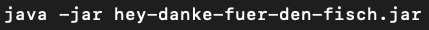
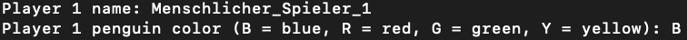
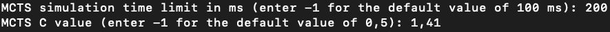
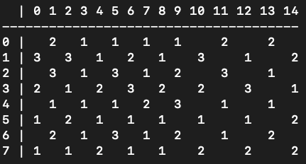
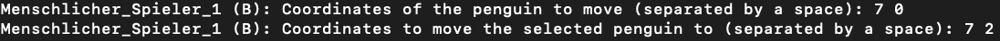
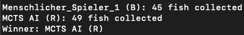

# Eine KI für das Strategiespiel "Hey, Danke für den Fisch!"

Dieses Repository enthält den Source Code, den ich im Rahmen meiner Bachelorarbeit angefertigt habe. Da es sich um ein
Maven Projekt handelt, wird zur direkten Ausführung des Source Codes nicht nur Java 17 (oder neuer) benötigt, sondern
außerdem eine aktuelle Version von Maven.

Zur Ausführung des Programms ist jedoch die JAR-Datei "hey-danke-fuer-den-fisch.jar" gedacht, welche sich ebenfalls in
diesem Repository befindet. Wenn die Dateien heruntergeladen wurden, kann das Programm ausgeführt werden, indem die
Konsole im Ordner des Projekts geöffnet und der Befehl "java -jar hey-danke-fuer-den-fisch.jar" ausgeführt
wird. Das Programm wird dann in der Konsole gestartet. Eine fehlerfreie Ausführung kann nur bei der Verwendung von
Java 17 oder einer neueren Version gewährleistet werden.

Durch das Programm kann das Spiel "Hey, Danke für den Fisch!" mit menschlichen Spielern und verschiedenen KIs gespielt
werden. Die Regeln können
der [offiziellen Anleitung](https://gesellschaftsspiele.spielen.de/uploads/files/3146/58bc3fd6793df.pdf) entnommen
werden. Zu Beginn muss zunächst die Anzahl der Spieler angegeben werden, die zwischen 2 und 4 liegen muss.

Anschließend muss für jeden Spieler dessen Typ angegeben werden. Typ 1 ist ein menschlicher Spieler, der manuell durch
Eingaben in der Konsole gesteuert wird. Typ 2 ist eine Random KI, die komplett zufällige Züge spielt. Typ 3 ist eine
Greedy KI, die in der ersten Phase ebenfalls zufällige Züge spielt, in der zweiten Phase aber immer möglichst viele
Fische sammelt. Typ 4 ist eine MCTS-KI, die den UCT-Algorithmus mit Light Playouts nutzt, um den besten Spielzug zu
bestimmen.

Für einen menschlichen Spieler muss zusätzlich dessen Name festgelegt und eine Farbe ausgesucht werden. Als Name kann
jeder beliebige Text verwendet werden. Die Farbe der Pinguine wird durch den entsprechenden Anfangsbuchstaben
spezifiziert (die Eingabe funktioniert mit Klein- und Großbuchstaben).

Für die MCTS-KI müssen zwei Parameter angegeben werden. Zunächst muss das Zeitlimit für die Simulationen (in
Millisekunden) festgelegt werden. Durch die Eingabe von -1 wird der Standardwert von 100 ms verwendet. Anschließend muss
der Wert des C-Parameters für die UCT-Formel spezifiziert werden (als Dezimalzahl). Hier wird durch die Eingabe von -1
der Wert von 0,5 als Standard verwendet.

Nachdem die Details für alle Spieler vervollständigt wurden, beginnt zunächst die erste Phase des Spiels. Dabei müssen
die Spieler abwechselnd je einen Pinguin auf eine unbesetzte Ein-Fisch Eisscholle setzen. Die KIs führen ihre Züge
automatisch aus, menschlicher Spieler müssen ihre Züge jedoch manuell eingeben. Dafür wird ein Koordinatensystem aus 8
Zeilen und 15 Spalten verwendet. Die Koordinaten müssen durch ein Leerzeichen getrennt eingegeben werden, wobei die
erste Zahl für die Zeile steht (y-Achse) und die zweite Zahl für die Spalte (x-Achse).

Bei der Platzierung muss also jeweils eine Koordinate einer freien Ein-Fisch Eisscholle eingegeben werden.

In der zweiten Phase des Spiels muss jeweils ein Pinguin bewegt werden. Dazu muss ein menschlicher Spieler zunächst die
Koordinaten einer seiner Pinguine eingeben und dann die Koordinaten einer freien Eisscholle, auf die dieser gemäß der
Regeln bewegt werden kann.

So wird das Spiel fortgeführt, bis es irgendwann endet. Dann wird das Ergebnis der Partie angezeigt.

Das Programm wird dann terminiert und muss durch den Befehl "java -jar hey-danke-fuer-den-fisch.jar" erneut gestartet
werden, um eine neue Runde zu spielen.